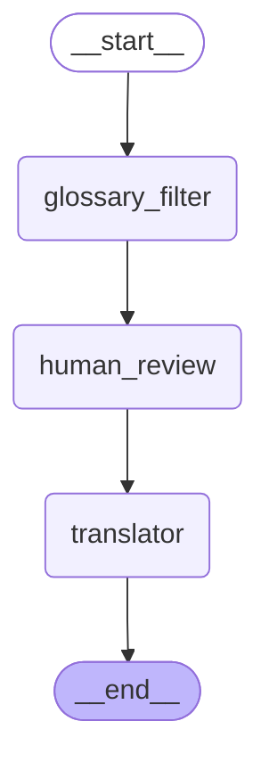

```mermaid
---
config:
  flowchart:
    curve: linear
---
graph TD;
	__start__([<p>__start__</p>]):::first
	glossary_filter(glossary_filter)
	human_review(human_review)
	translator(translator)
	__end__([<p>__end__</p>]):::last
	__start__ --> glossary_filter;
	glossary_filter --> human_review;
	human_review --> translator;
	translator --> __end__;
	classDef default fill:#f2f0ff,line-height:1.2
	classDef first fill-opacity:0
	classDef last fill:#bfb6fc

```